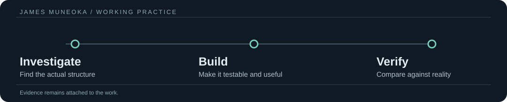

# James Muneoka

**Independent Technical Researcher · Systems / Data / Automation · Software Builder**

Find what is actually there. Trace what changes. Separate observation from assumption. Build the smallest thing that can test the problem. Keep the evidence.

**[Selected work](SELECTED_WORK.md)** · **[Capabilities](ABILITY.md)** · **[Working with me](WORK_WITH_ME.md)** · [Projects](PROJECTS.md) · [Research](RESEARCH.md) · [Opinions](OPINIONS.md)

---

## What I do

| Research and investigation | Software and data | Verification and agents |
| --- | --- | --- |
| Recover what an unfamiliar system actually does. Locate the first unsupported assumption. | Build Python tools, data transformations, integrations, validators, and bounded applications. | Test real state changes, agent actions, failure recovery, and expected-versus-observed behavior. |
| **Output:** a reproducible finding or smaller testable question. | **Output:** a usable artifact with inputs and handoff instructions. | **Output:** a test trace, a correction, or an explicit unresolved boundary. |

A problem can move through all three. The work should still make sense to someone who never saw the investigation.

## Selected work

| Work | What was tested or built | Evidence status |
| --- | --- | --- |
| **ARC interactive-system research** | Completed SK48 (8/8), LS20 (7/7), and FT09 (6/6) in local tests. Built a frame-driven FT09 policy that verified its own predicted clicks. | **Local replay/agent tests**; implementation not yet public |
| **Continuity / cross-system runtime** | State and evidence-preserving handoffs, traceability, task flows, external feeds, and integration boundaries. | **Ongoing**; development repository private |
| **Unknown-system experiments** | Focused investigations of runtimes, files, repositories, HTTP, and state transitions; retained counterexamples and test witnesses. | **Research archive private** |

[Read the results and their limits →](SELECTED_WORK.md)

## Work I can take on

- **Debug a system:** inspect existing code or a workflow, reproduce the break, isolate the cause, and test a repair.
- **Make messy data usable:** transform, validate, reconcile, or automate CSV/Excel files, API records, and repeated steps.
- **Build and test a tool:** a Python utility, data integration, workflow aid, small application, or agent-evaluation harness.

The starting point is the actual input and the needed output, not a long discovery pitch. [How I scope and deliver work →](WORK_WITH_ME.md)

## Research

Research is not a separate hobby page tucked behind the engineering. It is how I get from an unclear problem to a bounded implementation.

Questions currently in reach: specification recovery, behavior tracing, evidence and provenance, stateful agents, representation differences, incomplete information, and testing across system boundaries.

[Research notes →](RESEARCH.md) · [Working method →](docs/RESEARCH_METHOD.md)

## Current direction

**Near term:** independent technical projects and paid problem-solving across systems, data, automation, Python, existing software, and agent evaluation.

**Building toward:** complete public-data applications—ingestion, reconciliation, persistence, API, interface, deployment, monitoring—with each part checked against actual behavior.

**Continuing research:** learning and testing how action, observation, state, and evidence relate across unlike systems. A result that only works on one known example stays labeled that way.

## Position

Evidence should constrain confidence. Unknown is a valid technical state. Failed experiments belong in the record. Research and engineering belong in the same loop.

[More of my technical positions →](OPINIONS.md)

---

**Project access:** Some ongoing development and research repositories are private. This public page does not present inaccessible links as public demonstrations. Measured local results and future work are labeled separately.
