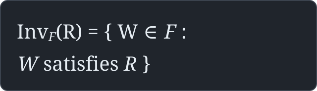
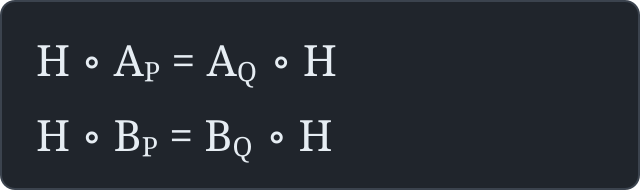

# James Muneoka

**MATHEMATICAL SYSTEMS RESEARCH** / transformation laws · inverse construction · relational correspondence

[](https://github.com/huntingthereferent/language-network)
[](https://github.com/huntingthereferent/language-network)
[](https://github.com/huntingthereferent/language-network/blob/main/work/arc_like_maze/README.md)
[](https://github.com/huntingthereferent/language-network/blob/main/work/arc_like_maze/ENGINE_ONE.md)
[](https://github.com/huntingthereferent/language-network)
[](PROVENANCE.md)
[](https://github.com/huntingthereferent/language-network/blob/main/AB_CONTRACT.md)

---

## 00 / Research Abstract

**Referent.** Mathematical relations between constructed transformation systems, their generating laws, the structures that preserve them, and the obstructions that prevent an identification.

The research starts with observation and an existing relation. It asks which constructions are admitted by that evidence, how unlike systems correspond, what changes when their laws change, and which relations survive extension, composition, re-rooting, or a change of representation.

**A/B** names the mathematical investigation. The finite-field engines are constructed models used to test it; they are not a universal definition of A/B. The runtime, research board, applications, and website are separate realizations—not substitutes for the mathematics.

**State of evidence:** explicit finite constructions, declared all-depth formulas, executable classifiers, positive correspondence witnesses, and counterexamples. No universal inverse A/B construction, cross-domain correspondence theorem, or physical-universe model has been established.

> [!WARNING]
> **Human-use safety — suicide and self-harm.** This research is not a prescribed way of thinking. Suicidal thoughts, self-harm urges, or feeling unable to stay safe are **not** stages of A/B, mathematical insight, or reasons to continue an experiment. Stop and seek human support. In the U.S., call or text **988**; for immediate danger, call **911** or the local emergency number. [Human-use boundary](#05--human-consequence--antechamber).

## 01 / Mathematical Objects

**Inverse construction.** Start with a stated family of possible laws and requirements witnessed by evidence. Keep every law in that family that satisfies those requirements; do not assume the result is unique or reaches outside the declared family.



**Full-state correspondence.** To show two specified A/B systems are conjugate, one bijection of their complete state spaces must preserve **both** generating transformations, with their labels intact:



A correspondence on an invariant B-fiber alone proves neither of these full two-generator conditions automatically. Rooted history, whole-state equivalence, quotient alignment, and transport of a **selected** symmetry are separate mathematical claims.

The research moves through several distinct operations:

| Relation under investigation | Mathematical question | Entry |
| :--- | :--- | :--- |
| **Inverse construction** | Which candidate laws satisfy the witnessed requirements? Can an admitted construction path produce another law? | [Engine 1](https://github.com/huntingthereferent/language-network/blob/main/work/arc_like_maze/ENGINE_ONE.md) · [source](https://github.com/huntingthereferent/language-network/blob/main/work/arc_like_maze/engine_one.py) |
| **Extension / inverse limits** | Can compatible projections carry a relation through every declared coordinate depth? | [Inverse-limit mathematics](https://github.com/huntingthereferent/language-network/blob/main/work/arc_like_maze/inverse_limit.py) · [full record](https://github.com/huntingthereferent/language-network/blob/main/work/arc_like_maze/README.md) |
| **Processes of changing laws** | When are entire rule streams equivalent, not just individual state snapshots? | [Process alignment](https://github.com/huntingthereferent/language-network/blob/main/work/arc_like_maze/process_alignment.py) |
| **Operators on rule systems** | Does a reversible construction preserve the relational quotient, or only a description of it? | [Process operators](https://github.com/huntingthereferent/language-network/blob/main/work/arc_like_maze/process_operators.py) · [non-diagonal transport](https://github.com/huntingthereferent/language-network/blob/main/work/arc_like_maze/NONDIAGONAL_TRANSPORT.md) |
| **Pointed / full-state distinctions** | Which maps preserve an origin, a selected witness, and both A/B actions? Which invariant obstructs them? | [Two-predecessor laws](https://github.com/huntingthereferent/language-network/blob/main/work/arc_like_maze/WINDOW_TWO.md) · [pointed coupling classification](https://github.com/huntingthereferent/language-network/blob/main/work/arc_like_maze/POINTED_COUPLING_CLASSIFICATION.md) |
| **Continuation of a WATCH** | Can an inconclusive inquiry resume the same transformation and keep all prior observations intact? | [Cyclic Action Engine](https://github.com/huntingthereferent/language-network/blob/main/work/arc_like_maze/CYCLIC_ACTION_ENGINE.md) · [continuation tests](https://github.com/huntingthereferent/language-network/blob/main/network/tests/test_arc_like_cyclic_action_continuation.py) |

The admission rule is not *“a construction looks similar.”* It is a concrete witness: an explicit transformation, compatibility equation, classifier, invariant, or counterexample under the declared conditions.

## 02 / Results & Witnesses

Selected finite-field results. These numbers refer to **different mathematical families or equivalence notions**; they are not interchangeable totals.

| Investigation | Recorded result | Scope / witness |
| :--- | :--- | :--- |
| Coupling-tower rooted classification | **81 → 21**, **729 → 85**, **6,561 → 341** | Constructed finite families and origin-rooted A/B classes; not a universal classification. [Research source](https://github.com/huntingthereferent/language-network/blob/main/work/arc_like_maze/README.md) |
| Two-predecessor full-state classification | **48 laws; 14 full-state classes; 16 origin-preserving classes** | Changing the mark can change the classification without changing the underlying full-state relation. [Exact family](https://github.com/huntingthereferent/language-network/blob/main/work/arc_like_maze/WINDOW_COMBINED.md) |
| Construction processes | **81 two-phase rule templates; 34 diagonal process classes** | Coinductive, all-depth alignment for the declared eventually periodic grammar. [Process record](https://github.com/huntingthereferent/language-network/blob/main/work/arc_like_maze/README.md) |
| Process-level operators | **324** template/gauge alignments; **1,296** tested compositions | A four-element period-two coordinate-gauge subgroup preserves the specified relation; shifting raw descriptions need not. [Operator source](https://github.com/huntingthereferent/language-network/blob/main/work/arc_like_maze/process_operators.py) |
| New law versus new representation | Depth-three B-fixed states **9 vs. 6** | An independently edited two-input coupling gives a genuine full-state obstruction; nonlinear shear conjugacy by itself does not. [Construction proof](https://github.com/huntingthereferent/language-network/blob/main/work/arc_like_maze/WINDOW_TWO.md) |
| Fifth-coordinate admission and selected symmetry | **486** fourth-coordinate configurations; **30,510** admitted configuration/coupling combinations | Distinct correction choices, admissibility, cyclic orders, and marked-point transport retained separately. [Classifier](https://github.com/huntingthereferent/language-network/blob/main/work/arc_like_maze/POINTED_COUPLING_CLASSIFICATION.md) |
| Restricted cyclic B-action | Distinction at B⁹; separate positive B-intertwiner at B²⁷ | The declared **81-state invariant fiber**, not a full A/B equivalence theorem. [Case](docs/FINITE_STATE_CONJUGACY.md) |

**In-progress integration.** [Continuity Engine / fifth-coupling classification — PR #18](https://github.com/huntingthereferent/language-network/pull/18) preserves further historical experiments, a scoped 243-state model and 19,683 coupling laws. It remains **open and unmerged** while integrated validation is unresolved. Do not promote local classification or archive integrity results into a passing CI claim.

## 03 / Open Mathematical Boundary

The present frontier is not simply more states or larger numbers. It is understanding what happens **when the construction relation itself changes**.

- **Backwards:** recover candidate generating rules from a witnessed relation without inventing a unique predecessor.
- **Across:** distinguish actual correspondence from collisions of finite invariants or chosen projections.
- **Nested / higher order:** determine which constructions on entire rule systems preserve their admitted relations under further construction.
- **Re-entry:** preserve the original mathematical question through UNKNOWN, obstruction, further evidence, and valid continuation.

**Known wall:** closure under a *selected* set of construction operators is not closure under every possible operator. A reversible rewrite of a rule description need not descend to an equivalence class. Agreement at finite depth need not establish identity at every depth.

The next construction is selected by the **current witnessed mathematical question**, not by a product roadmap or a requirement to keep inventing new engines.

## 04 / Experimental & Engineering Surfaces

These records exist to test, preserve, or realize work. They are **not** competing definitions of the mathematical research.

| Surface | Relation to research | Evidence |
| :--- | :--- | :--- |
| [Continuity Layer](https://github.com/huntingthereferent/language-network) | Cross-system evidence, state, handoffs, trace ancestry and re-entry. A software carrier, not A/B. | [Architecture](https://github.com/huntingthereferent/language-network/blob/main/ARCHITECTURE.md) · [entry contract](https://github.com/huntingthereferent/language-network/blob/main/ENTRY.md) |
| [ARC-AGI-3 investigation](ARC_EVIDENCE.md) | Independent interactive environments expose real observation/action boundaries. | [Saved routes, replay source, visual policy and negative trials](https://github.com/huntingthereferent/language-network/tree/main/research/arc_native_runs); local reported completions are not independent first-contact solver verification. |
| [Construction comparison — PR #14](https://github.com/huntingthereferent/language-network/pull/14) | Controlled preserve/explore proposals against other ways to generate candidates. | Draft branch, unresolved newer CI; no comparative advantage is asserted. |

<details>
<summary><b>Adjacent practical work / retained records</b></summary>

Jobs, paid work, applications, school, factory, personal operations, and complete-stack engineering may become the **current practical problem** because circumstances require them. They are valid problems, not failures of mathematical focus. Each retains its own evidence and follow-through conditions; entering one does not silently replace the mathematical referent.

Solving a problem does not by itself imply an indefinite maintenance obligation. A usable result, remaining wall, and explicit handoff should make the boundary visible.

Historical work is preserved under [project records](PROJECTS.md), [selected cases](SELECTED_WORK.md), [technical range](ABILITY.md), and the [underlying repository](https://github.com/huntingthereferent/language-network).

</details>

## 05 / Human Consequence & Antechamber Protocol

**Long-horizon question:** What becomes possible for independent people and institutions if investigation, coordination, and execution can be carried without forcing unlike actors into one objective or requiring one participant to remain the permanent operator?

This is a research motivation, **not** a demonstrated mathematical or social consequence. Automating reasoning does not itself resolve economic pressure, institutional responsibility, relationships, physical needs, or access to resources.

**Human-facing reference:** [The Antechamber Protocol — The Steppers](https://thestepps.wordpress.com/).

The mathematics is not a prescription for being human. Someone may encounter A/B expecting it to fix everything and then discover that **A/B is just A/B**. The Antechamber Protocol describes why a quieter, voluntary space might matter at that point: to distinguish what the mathematics establishes from what was hoped for, and to find or recover a personal reason to continue without public spectacle, compulsory agreement, or disclosure.

This is a **proposed human-use boundary**, not an operating private refuge, a therapeutic program, membership, diagnosis, or theorem. It does not establish that James has physically left, completed, or enacted the possible movements studied in mathematics. People may participate, return to ordinary responsibilities, disengage, or decline without treating their responses as evidence of A/B. Privacy must not require isolation or loss of independent support.

**Safety boundary.** No interpretation of A/B requires enduring severe distress, sleep loss, isolation, suicidal thinking, or urges to self-harm. Those concerns warrant ordinary human and professional support, not further immersion as a supposed mathematical test. There is no established evidence that A/B causes a predictable psychological sequence.

## 06 / Research Record

**Primary notebook:** [Finite-field A/B constructions and proofs](https://github.com/huntingthereferent/language-network/blob/main/work/arc_like_maze/README.md) · [Research notebook](RESEARCH.md).

**Proof and source:** [Inverse construction](https://github.com/huntingthereferent/language-network/blob/main/work/arc_like_maze/ENGINE_ONE.md) · [Cyclic Action Engine](https://github.com/huntingthereferent/language-network/blob/main/work/arc_like_maze/CYCLIC_ACTION_ENGINE.md) · [Mathematical terminology](https://github.com/huntingthereferent/language-network/blob/main/work/arc_like_maze/TERMINOLOGY.md).

**Evidence and limitations:** [Witness ledger](PROVENANCE.md) · [ARC evidence](ARC_EVIDENCE.md) · [Selected experimental records](SELECTED_WORK.md).

<details>
<summary><b>Method / reproduction contract</b></summary>

```text
CURRENT REFERENT
  -> observe source / state / transformation
  -> state an admissible relation and mathematical question
  -> construct / compare / continue under declared conditions
  -> verify a witness, counterexample, or exact wall
  -> preserve source + ancestry + uncertainty + next referent
```

An equation with an all-depth proof, an executable finite check, an unrun committed test, a locally reported run, and externally reproduced behavior are different evidence states. Do not substitute one for another.

</details>
